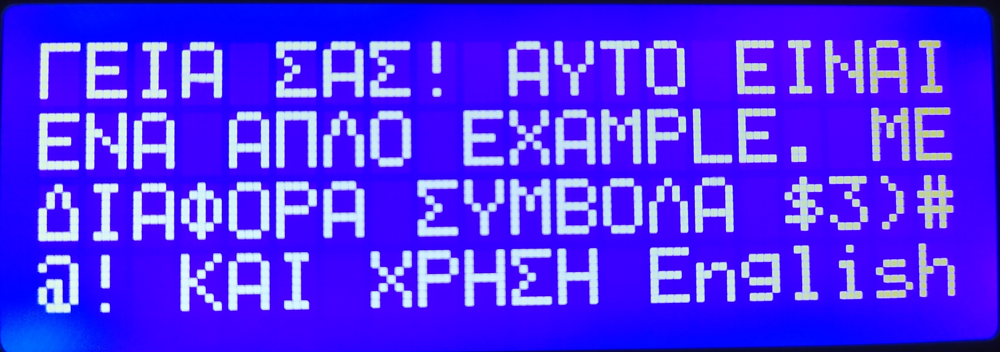
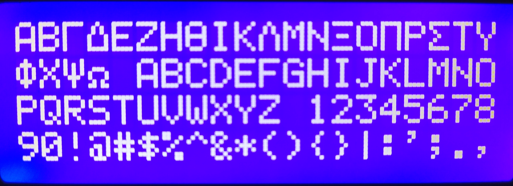

# lcd-greek-chars  

A header file to use Greek Characters on 2004/1602 LCD Screen with arduino or other related MCUs.

## Χρήση
Για να μπορέσετε να εμφανίσετε ελληνικούς χαρακτήρες στην οθόνη σας, αρκεί να κάνετε
include το header file lcd-greek-chars.h, να χρησιμοποιήσετε κατά το setup την μέθοδο 
createGreekChars() και κάθε φορά που θέλετε να εμφανίσετε κείμενο στην LCD αντί της lcd.print να χρησιμοποιήσετε την ektypwse(). 

## Example
Μπορείτε να βρείτε παράδειγμα χρήσης της βιβλιοθήκης στον ομότιτλο [φάκελο](./example).

## Note:
Δυστυχώς λόγο του περιορισμού της μνήμης του HD44780 που βρίσκεται
συνήθως σε αυτές τις οθόνες μπορούν να προσθέσουμε μόνο 8 επιπλέον
χαρακτήρες τα οποία χρειάζονται, για να γίνει εφικτή η εγγραφή σε 
ελληνικά. Για αυτόν τον λόγο μετατρέπεται κάθε ελληνικός χαρακτήρας 
σε κεφαλαία ωστέ να μπορεί να γραφτεί οποιαδήποτε ελληνική λέξη.
